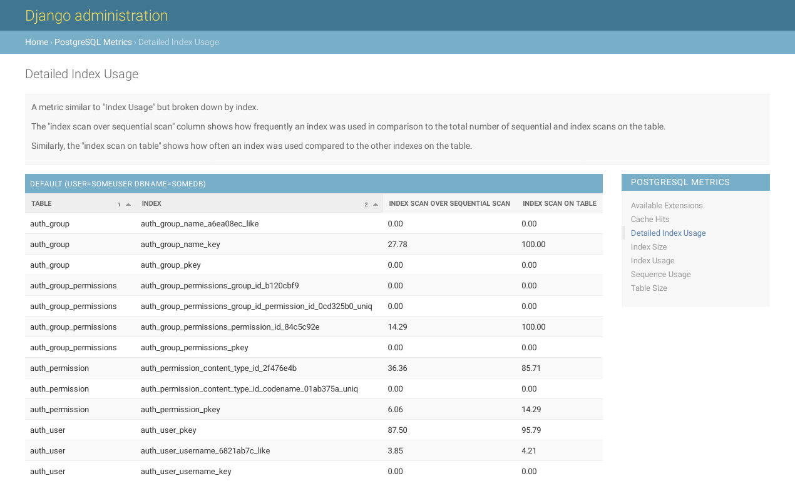

.. _usage:

Using django-postgres-metrics
=============================

.. _django-admin-integration:

Django Admin Integration
------------------------

When you now browse to the Django Admin with superuser permissions, you'll see
a "PostgreSQL Metrics" section at the bottom left, listing all available
metrics.

This is what a metric could look like:

       a table with rows for each index

.. _command-line-interface:

Command Line Interface
----------------------

While the Django Admin is often installed and used by many, there are numerous
projects that do not use it. For them, django-postgres-metrics 0.13 brings a
few management commands that provide the same information.

``pgm_list_metrics``
~~~~~~~~~~~~~~~~~~~~

This command lists all available metrics.

       with their slug, label and description.

``pgm_show_metric``
~~~~~~~~~~~~~~~~~~~

This command shows the metric's data. The command expects the ``slug`` from the
``pgm_list_metrics`` command output as the first argument.

       output for the detailed index usage.
